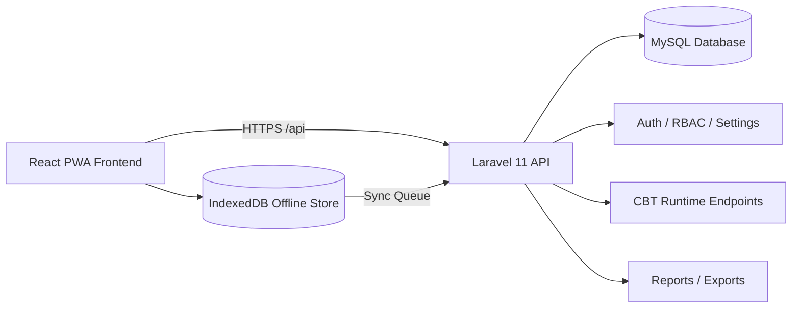

# CBT System

> Offline-capable, role-based Computer-Based Testing platform for schools (JSS/SSS), built with Laravel + React PWA.


---

## Table of Contents

- [Overview](#overview)
- [What the System Includes](#what-the-system-includes)
- [Role Access Model](#role-access-model)
- [Architecture](#architecture)
- [Repository Structure](#repository-structure)
- [Technology Stack](#technology-stack)
- [Quick Start (Windows/XAMPP)](#quick-start-windowsxampp)
- [Environment Configuration](#environment-configuration)
- [Database, Migrations, Seeders](#database-migrations-seeders)
- [How to Run (Dev)](#how-to-run-dev)
- [API Surface (High-Level)](#api-surface-high-level)
- [Offline CBT Runtime Flow](#offline-cbt-runtime-flow)
- [Security and Controls](#security-and-controls)
- [Troubleshooting](#troubleshooting)
- [Project Documentation Map](#project-documentation-map)
- [License](#license)

---

## Overview

CBT System is a comprehensive exam delivery and management platform with:

- **Online + Offline exam-taking** through a React PWA and IndexedDB sync queue.
- **Role-based administration** for Main Admin, Admin, Teacher, and Student.
- **Question-bank-driven exam design** with pools, tags, randomization, and import/export.
- **Exam access controls** (codes, verification, attempts, visibility toggles).
- **Academic administration** (students, classes, departments, subjects, onboarding).
- **Reporting and governance** (results, analytics, exports, activity logs, settings).

> Current codebase source-of-truth is Laravel API routes/controllers in `backend/` and React app routes/pages in `frontend/`.

---

## What the System Includes

### Student-facing

- Student registration and onboarding flow
- Student login and profile management
- Subject selection (post-registration workflow)
- Exam access and exam runtime pages
- Offline exam runtime support (`/offline-exam/:examId`)
- Result access (when exam visibility/release rules allow)
- Student announcements page

### Admin/Teacher-facing

- Authentication and profile management
- Role/permission-aware dashboard routes
- Question bank entry and management
- Exam management and monitoring
- Exam access verification flows
- Results and marking workflows
- Academic structure management (classes, departments, subjects)
- Hall/allocation modules and related run tables
- Announcements and pages
- Activity logs and system settings (Main Admin scoped controls)

### Platform capabilities

- Laravel Sanctum authentication
- 2FA and recovery-related flows
- Rate-limited runtime endpoints
- Offline attempt sync endpoints (cloud/LAN variants)
- CSV import/export and report export modules
- Migration-driven schema evolution through **March 2026**

---

## Role Access Model

The system enforces route-level role middleware with scoped access:

- **Main Admin**: full admin access + system settings/governance controls
- **Admin**: full operational management (exams, questions, students, reports)
- **Teacher**: teaching/monitoring/marking scoped permissions
- **Student**: student dashboard + exam-taking experiences

Middleware patterns are implemented in Laravel route groups (example: `auth:sanctum`, `role:*`, teacher scope middleware).

---

## Architecture



### Runtime split

- **General admin/student APIs**: `/api/*` route groups
- **Dedicated CBT runtime endpoints**: `/api/cbt/*` (verify/start/state/questions/answer/event/submit/ping)
- **Offline synchronization**: `/api/sync/*` and `/api/local-sync/*`

---

## Repository Structure

```text
CBT-System/
├── backend/                  # Laravel API application
│   ├── app/                  # Controllers, Models, Middleware, Services
│   ├── bootstrap/
│   ├── config/
│   ├── database/
│   │   ├── migrations/       # Full schema evolution history
│   │   └── seeders/          # Role/Admin/Exam/Settings/etc seeders
│   ├── public/
│   ├── resources/
│   ├── routes/
│   │   ├── api.php           # Main API route map
│   │   └── web.php
│   ├── storage/
│   └── tests/
├── frontend/                 # React + TypeScript PWA
│   ├── src/
│   │   ├── pages/
│   │   ├── cbt-interface/
│   │   ├── services/
│   │   ├── store/
│   │   ├── hooks/
│   │   ├── middleware/
│   │   └── components/
│   └── public/
├── docs/                     # Implementation and operational docs
└── README.md
```

---

## Technology Stack

| Layer               | Technology                                        |
| ------------------- | ------------------------------------------------- |
| Backend             | Laravel 11, PHP 8.2+, Sanctum                     |
| Auth/RBAC           | Sanctum + Spatie Laravel Permission               |
| Frontend            | React 18, TypeScript, TailwindCSS, React Router   |
| State/Utilities     | Zustand, Axios, Dexie (IndexedDB), Workbox window |
| Database            | MySQL                                             |
| Exports             | Laravel Excel, DomPDF                             |
| Security extensions | Google2FA package integration                     |

---

## Quick Start (Windows/XAMPP)

## 1) Backend install

```powershell
cd backend

# Install dependencies (if composer command is not in PATH)
& 'C:\xampp\php\php.exe' composer.phar install

# Create env file
Copy-Item .env.example .env

# Generate app key
& 'C:\xampp\php\php.exe' artisan key:generate

# Publish package assets
& 'C:\xampp\php\php.exe' artisan vendor:publish --provider="Spatie\Permission\PermissionServiceProvider"

# Run migrations
& 'C:\xampp\php\php.exe' artisan migrate
```

## 2) Frontend install

```powershell
cd ..\frontend
npm install
Copy-Item .env.example .env
```

## 3) Run servers

**Terminal A (Backend):**

```powershell
cd backend
& 'C:\xampp\php\php.exe' artisan serve --host=127.0.0.1 --port=8000
```

**Terminal B (Frontend):**

```powershell
cd frontend
npm start
```

Default local URLs:

- Frontend: `http://localhost:3000`
- Backend API: `http://127.0.0.1:8000/api`
- Health endpoint: `http://127.0.0.1:8000/api/health`

---

## Environment Configuration

### Backend (`backend/.env`)

Minimum required values:

```dotenv
APP_ENV=local
APP_DEBUG=true
APP_URL=http://127.0.0.1:8000

DB_CONNECTION=mysql
DB_HOST=127.0.0.1
DB_PORT=3306
DB_DATABASE=cbt_system
DB_USERNAME=root
DB_PASSWORD=

FRONTEND_URL=http://localhost:3000
```

### Frontend (`frontend/.env`)

```dotenv
REACT_APP_API_URL=http://127.0.0.1:8000/api
REACT_APP_ENV=development
REACT_APP_VERSION=1.0.0
```

> Note: some templates/docs in the repo still mention legacy `:5000` values from an older scaffold. For current Laravel runtime, use `:8000` unless you changed the backend port.

---

## Database, Migrations, Seeders

### Migrations

Run all schema updates:

```powershell
cd backend
& 'C:\xampp\php\php.exe' artisan migrate
```

The migration history includes modules for:

- Core users/students/exams/questions/attempts
- Permissions and personal access tokens
- Academic entities (classes/departments/subjects)
- Exam access and CBT runtime support tables
- Offline/sync safety and runtime telemetry fields
- Hall allocation, seat conflicts, and runs
- Role scopes and approval/request fields

### Seeders

Available seeders include:

- `RoleSeeder`
- `AdminSeeder`
- `SubjectDepartmentSeeder`
- `ExamSeeder`
- `SystemSettingSeeder`
- Others in `backend/database/seeders`

Run all default seeders:

```powershell
cd backend
& 'C:\xampp\php\php.exe' artisan db:seed
```

Run a specific seeder:

```powershell
& 'C:\xampp\php\php.exe' artisan db:seed --class=RoleSeeder
```

---

## How to Run (Dev)

### Root-level helper scripts

From repo root:

```bash
npm run dev
npm run start
npm run build
npm run test
```

These map to frontend scripts in this repository.

### Frontend scripts

```bash
npm start        # react-scripts + tailwind watch
npm run dev      # react-scripts start
npm run build
npm test
```

---

## API Surface (High-Level)

The API is extensive. Route groups in `backend/routes/api.php` include:

- `GET /api/health`
- `POST /api/auth/*` (login, verification, password flows)
- `POST /api/exam-access/verify`
- `GET|POST /api/students/*`
- `GET|POST|PUT|DELETE /api/exams/*`
- `GET|POST|PUT|DELETE /api/questions/*`
- `GET|POST /api/question-tags/*`
- `GET|POST /api/exams/{examId}/pools/*`
- `GET|POST /api/results/*`
- `POST /api/sync/*`, `POST /api/local-sync/*`
- `GET|POST /api/cbt/*` (runtime)

For exact payloads and constraints, review:

- `backend/routes/api.php`
- controller methods under `backend/app/Http/Controllers/Api`

---

## Offline CBT Runtime Flow

1. Student verifies access and starts attempt via CBT endpoints.
2. Questions/state are fetched and cached for continuity.
3. Answers and events are captured continuously.
4. If connectivity drops, queue persists locally.
5. Sync endpoints flush queued data when network returns.
6. Attempt finalization and metadata are stored server-side.

This design supports unstable network environments without breaking exam continuity.

---

## Security and Controls

- Sanctum-based authenticated route protection
- Role and scope middleware enforcement on protected route groups
- Rate limiting for auth and high-frequency CBT runtime endpoints
- Optional 2FA-related capabilities and recovery support
- Dedicated student exam access verification flow
- Activity logging and privileged settings modules

---

## Troubleshooting

| Issue                                   | Action                                                         |
| --------------------------------------- | -------------------------------------------------------------- |
| `php` not found                         | Use full path `C:\xampp\php\php.exe` in commands               |
| `composer` not found                    | Use `composer.phar` with XAMPP PHP                             |
| Migration errors                        | Verify MySQL credentials/database in `backend/.env`            |
| Frontend cannot reach API               | Set `REACT_APP_API_URL` to backend URL/port                    |
| Package install fails on PHP extensions | Enable required extensions (commonly `gd`, `zip`) in `php.ini` |
| Auth/session issues                     | Check Sanctum/session domain values and CORS-related config    |

---

## Project Documentation Map

Primary docs to consult:

- `docs/API.md`
- `docs/ARCHITECTURE.md`
- `docs/COMPLETE_SETUP_GUIDE.md`
- `docs/FINAL_STATUS_REPORT.md`
- `CBT_SYSTEM_COMPLETE_FEATURES.md`

> Some older docs still describe an earlier Node/Express scaffold. Use Laravel code (`backend/routes`, controllers, migrations) as the authoritative implementation reference.

---

## Production Deployment

### Recommended topology

- **Frontend**: static build (`frontend/build`) served by Nginx/Apache or CDN
- **Backend**: Laravel app on PHP-FPM/Apache
- **Database**: MySQL (managed or self-hosted)
- **Background jobs**: Laravel queue worker (Supervisor/PM2 service equivalent)
- **Scheduler**: system cron invoking `artisan schedule:run`

### Build and publish steps

1. Build frontend:

```bash
cd frontend
npm ci
npm run build
```

2. Prepare backend:

```bash
cd backend
composer install --no-dev --optimize-autoloader
php artisan config:cache
php artisan route:cache
php artisan view:cache
php artisan migrate --force
```

3. Set file permissions for writable paths:

- `backend/storage/`
- `backend/bootstrap/cache/`

4. Run queue worker (example):

```bash
php artisan queue:work --tries=3 --timeout=120
```

5. Configure scheduler (cron):

```cron
* * * * * cd /path/to/CBT-System/backend && php artisan schedule:run >> /dev/null 2>&1
```

### Environment checklist (backend)

- `APP_ENV=production`
- `APP_DEBUG=false`
- `APP_URL` set to production API URL
- Correct production DB credentials
- Mail credentials for password/OTP workflows
- Sanctum/session/cors domains aligned with frontend domain
- Queue connection configured (`database`, `redis`, etc.)

### Web server notes

- Point backend web root to `backend/public`
- Enforce HTTPS
- Add gzip/brotli and static cache headers for frontend assets
- Ensure API reverse proxy preserves `Authorization` header

### Zero-downtime release pattern (recommended)

- Deploy to new release directory
- Install dependencies and build assets in release directory
- Run `php artisan migrate --force`
- Warm caches (`config`, `route`, `view`)
- Switch symlink/current release
- Restart PHP-FPM and queue workers gracefully

### Post-deploy validation

- `GET /api/health` returns healthy/degraded JSON response
- Admin login works
- Student exam access verify works
- CBT runtime endpoints respond (`/api/cbt/*`)
- Offline sync endpoints respond (`/api/sync/*`)

### Security hardening quick list

- Use strong secrets for app/mail/database
- Restrict database network access
- Disable directory listing
- Keep PHP/Laravel dependencies patched
- Enable central logs/monitoring and alerting for failed jobs

---

## License

Proprietary / Internal use.
